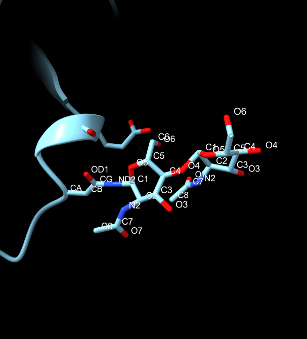
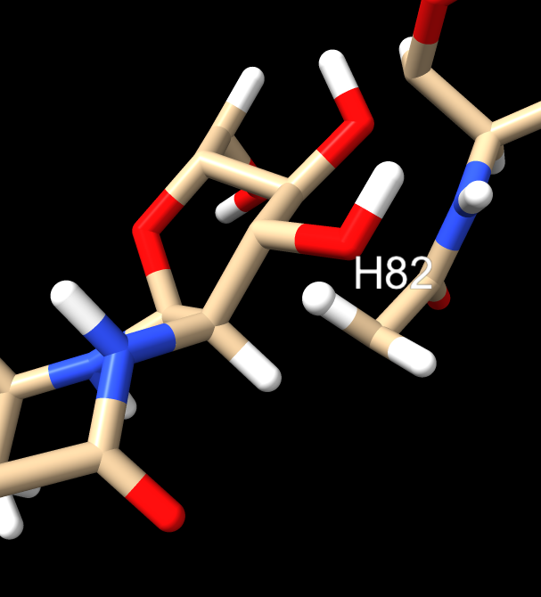

- [Descàrrega de fitxers](#descàrrega-de-fitxers)
- [Preparació del TPQ](#preparació-del-tpq)
- [Preparació del NAG](#preparació-del-nag)


## Descàrrega de fitxers

Primer de tot descarregarem els fitxers necessaris

```
wget -nc https://files.rcsb.org/download/1KSI.pdb
wget -nc https://files.rcsb.org/ligands/download/NAG.cif
wget -nc https://files.rcsb.org/ligands/download/TPQ.cif
```
Fem el pdb4amber del fitxer 1KSI
```
pdb4amber -i 1KSI.pdb -o dao.pdb --dry --reduce
```

## Preparació del TPQ

Per preparar el TPQ i que sigui reconegut per Amber haurem de fer el següent:
```
antechamber -fi ccif -i TPQ.cif -bk TPQ -fo ac -o tpq.ac -c bcc -at amber
```
Observant el document tenim un NT, que hem de canviar per un N
```
sed 's/NT/ N/' tpq.ac >tpq2.ac
```

Ara pel tpq farem un mc file per identificar els àtoms a ser omesos i quins pertanyen a la cadena principal. Anomenem al fitxer tpq.mc
```
HEAD_NAME N
TAIL_NAME C
MAIN_CHAIN CA
OMIT_NAME H2
OMIT_NAME OXT
OMIT_NAME HXT
PRE_HEAD_TYPE C
POST_TAIL_TYPE N
CHARGE 0.0
```
Amb aquest fitxer creat fem el prepgen.
```
prepgen -i tpq2.ac -o tpq.prepin -m tpq.mc -rn TPQ
```

Tot seguit fem el parmchk2
```
parmchk2 -i tpq.prepin -f prepi -o frcmod.tpq
```

## Preparació del NAG

El nostre residu modificat TPQ ja està parametritzat, ens falta el NAG, que de res ens serveix el seu document de pdb ja que necessitem crear-ho de 0 per a la nostra dao, on el NAG és un residu modificat lligat a DAO per ASN.
Per crear-ho de zero farem el següent, crear fitxers nous per a cada nag. AAG serà el nom del nou residu. ag1.pdb, ag2.pdb, ag1_2.pdb i ag2_2.pdb

El primer que farem serà visualitzar el fitxer dao.pdb i apuntar que ASN està amb quin NAG. Un cop se saben quines asn van amb quins nag, creem nous fitxers amb aquesta informació amb els noms anteriorment mencionats. I al pdb original que ens serveix per anar creant aquests fitxers, anem substituin la informació, de manera que no quedan nags, i les asn lligades a aquests tampocs i es converteixen en un únic residu.

<figure>
  
  <figcaption>chimerax: open 1ksi; select #2/A:131 #2/C:1,2</figcaption>
</figure>

Per avançar feina, també crearem un fitxer mc per al nou residu anomenat aag.mc:
```
HEAD_NAME N
TAIL_NAME C
MAIN_CHAIN CA
OMIT_NAME H5
OMIT_NAME H6
PRE_HEAD_TYPE C
POST_TAIL_TYPE N
CHARGE 0.0
```
Aquest arxiu el farem servir dos cops, ja que trobem només un nag unit a asn o dos en cadena. El fitxer de moment servirà per ag1.pdb que és senzill. Ara per ara ens falta afegir hidrogens, així que ho fem via openbabel i anomenem els fitxers ag1h.pdb i ag2h.pdb respectivament. Treiem els CONECT i MASTER i el número 553 el passem a 1 i els hidrogens sense número els hi posem per identificar més tard. Mirem la molècula amb chimerax. Eliminem h8 i hd21

Intentem fer un antechamber d'això
```
antechamber -fi pdb -i ag1h.pdb -fo ac -o ag1h.ac -c bcc -at amber -nc 0 -rn AAG -bk AAG
```

[hola](http://legacy.glycam.org/tools/molecular-dynamics/glycoprotein-builder/download-files)


WARNING: veiem que obtenim aquest Warning, que implica un problema amb l'estructura:

```
-- Check Format for pdb File --
   Status: pass
Warning: The assigned bond types may be wrong, please :
(1) double check the structure (the connectivity) and/or 
(2) adjust atom valence penalty parameters in APS.DAT, and/or 
(3) increase PSCUTOFF in define.h and recompile bondtype.c
    (be cautious, using a large value of PSCUTOFF (>100) will 
    significantly increase the computation time).
Info: Total number of electrons: 170; net charge: 0
```

Això sembla provenir d'un problema comú en cristalografia (veure la figura 4 a https://www.ncbi.nlm.nih.gov/pmc/articles/PMC6465985/, per exemple) a l'hora de determinar l'estructura de múltiples glycosilations en residus concrets.  Si observem el detall del pdb `ag1h.pdb`, s'hi ha afegit un hidrogen que no és correcte, però sibretaot que es tracta d'una estructura amb dosfragments de N-acetil glucosamina:

<figure>
  
  <figcaption>detall de l'estructura ag1h.pdb, on s'aprecia que hi ha dos fragments de N-acetil glucosamina</figcaption>
</figure>

Construeixo un fitxer que només en contingui una

El prepgen

```
prepgen -i ag1h.ac -o ag1h.prepin -m aag.mc -rn AAG
```

Per últim el parmchk2
```
parmchk2 -i ag1h.prepin -f prepi -o frcmod.ag1h -s gaff2
```
Ens dona error per uns DU atoms, que canviem manualment per correctes. L'arxiu resultant conté ATTN, que vol dir que necessiten revisió i seran eliminats amb:
```
grep -v "ATTN" frcmod.ag1h > frcmod1.ag1h
```
fem un altre parmchk2 sense gaff2
```
parmchk2 -i ag1h.prepin -f prepi -o frcmod2.ag1h -s gaff2
```
Carregarem els dos: frcmod2.ag1h i frcmod1.ag1h

Tot el que hem fet amb el primer ag1, ho hem fem amb el ag2h. 
```
antechamber -fi pdb -i ag2h.pdb -fo ac -o ag2h.ac -c bcc -at amber -nc 0 -rn AAG -bk AAG
```
Prepgen
```
prepgen -i ag2h.ac -o ag2h.prepin -m aag2.mc -rn AAG
```
Dona error a l'hora de fer antechamber, segurament els àtoms d'hidrogen no són els correctes.