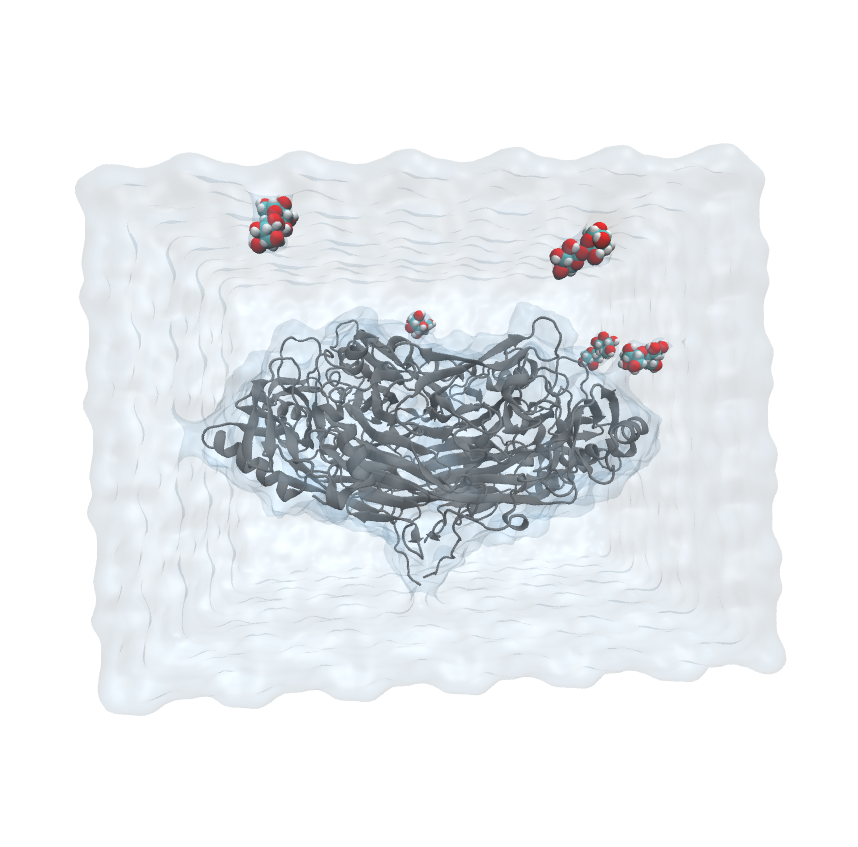

# Using tleap to prepare the calculations

## Simulation of DAO with TPQ without NAG

```
cd prepare
tleap -f tleap_dao_noNAG.in >tleap_dao_noNAG.out
```

## Simulation of DAO with TPQ without NAG with a different number of trehalose molecules

A script [`tleap_dao_noNAG_TRE.sh`](https://github.com/JordiVillaFreixa/Pau_TFG_DAO/blob/main/prepare/tleap_dao_noNAG_TRE.sh) has been created to generate the different leap input files.

Always check the log files for possible errors. Once you get the parm7 and rst7 files, [visualize them in vmd](https://emleddin.github.io/comp-chem-website/Analysisguide-loading-files-cl.html) with, eg:
```
vmd -parm7 ../inputs/dao_noNAG_TRE5.parm7 -rst7 ../inputs/dao_noNAG_TRE5.rst7
```
Try following the steps of [this video](https://www.youtube.com/watch?v=yIm3PwlpT_M) to reach this image:

